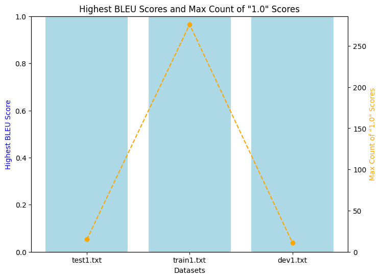
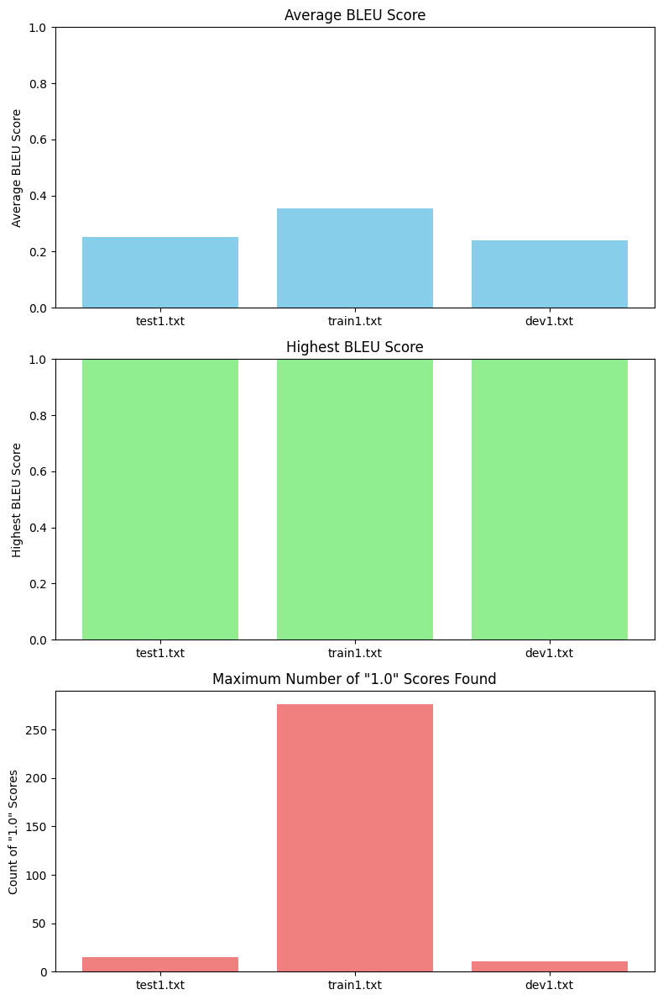

# MT_Transformers
Designed transformer model architecture from scratch using PyTorch for Machine Translation

## Files
- code.ipynb and code.py contain the same code. 
- The code was written in google colab and directly downloaded from there.
- You can find the link for the model here: https://drive.google.com/file/d/1vS6TB7gevzu4-ia8IuLx1ahRiB8EDHBm/view?usp=sharing

## Model Architecture
- This code has implementations of:
  
  - __Self-Attention Mechanism:__
  
    - It takes the embedding size and the number of attention heads as input.
  
    - This module includes linear layers for values, keys, queries, and a fully connected layer (fc_out).

  - __Encoder:__
  
    - A Transformer Block is defined, which includes self-attention and feed-forward layers. It incorporates layer normalization and dropout.

    - The Encoder is constructed with parameters like source vocabulary size, embedding size, number of layers, attention heads, dropout, and maximum sequence length.

    - It includes word embeddings and position embeddings.
  
    - The encoder consists of multiple TransformerBlocks.

  - __Decoder:__
  
    - A DecoderBlock is defined for the decoder part of the model. It involves self-attention, a transformer block, and dropout, similar to the encoder block.

    - The Decoder is constructed with parameters like target vocabulary size, embedding size, number of layers, attention heads, and dropout.

    - It also includes word embeddings and position embeddings.

    - The decoder comprises several DecoderBlocks and a linear layer for output.


## Model Training 
- The given corpus was cleaned and tokenized before usage.
- For tokenize we used: en_core_web_sm and fr_core_news_sm

- analysis of training:

  * Minimum Training Loss = 2.852672759656864
  * Minimum Validation Loss = 3.2048025131225586 
  
  * Epoch [1/4] - Loss (training)= 4.9972
 
## Hyperparameters

### __Parameters used:__
  - max_seq_length = 25
  
  - batch size = 64
  
  - learning rate = 0.001
  
  - device: cpu

  - Self-Attention Mechanism:
      - Linear layers for values, keys, queries, and an output linear layer (fc_out), each with an input and output size of 512.

  - activation : ReLU
  
  - criterion : cross entropy loss

  - optimizer : Adam
  
  - Embedding Size (embed_size): 512


### __Impact of parameters used:__
  - Embedding Size:

    - A larger embedding size (512) allowed the model to learn more fine-grained representations of words. This can help capture complex relationships between words in the source and target languages.

  - Number of Attention Heads (heads):

    - More attention heads enable the model to attend to different parts of the input sequence simultaneously, capturing various types of relationships.

  - Position Embedding (position_embedding):

    - The use of position embeddings (max sequence length) allowed the model to understand the positions of words in a sequence.
   

## Analysis
- To analyze the model, we shall test against bleu scores.
- You can find the bleu scores in: `scores/dev1.txt`, `scores/test1.txt` , `scores/train1.txt`

- Analysis:  
1. test1.txt
   - It contains the bleu scores for the test data.
   - Average bleu score = 0.2509477432856186
   - Highest bleu score found = 1.0
   - Maximum number of `'1.0'` score found = 15

2. train1.txt
   - It contains the bleu scores for the train data.
   - Average bleu score = 0.35504600250618773
   - Highest bleu score found = 1.0
   - Maximum number of `'1.0'` score found = 276


3. dev1.txt
   - It contains the bleu scores for the validation data.
   - Average bleu score = 0.2395754811671
   - Highest bleu score found = 1.0
   - Maximum number of `'1.0'` score found = 11

<br>

- We can further analyse this through the bar plot below:
  
    
   This is a bar plot with a dual y-axis, where the left y-axis represents the highest BLEU scores, and the right y-axis represents the maximum count of "1.0" scores.

<br>
<br>

- The three subplots below explain the same as above:

    

<br>
<br>


- __Further analysis:__
  
  - The model seems to perform relatively better on the training data, followed by the test data and then the validation data.

    
  - The average BLEU score for test and validation data is relatively low, indicating that there is room for improving translation quality.
    
  - Implementing techniques like beam search or using a more advanced loss function like label smoothing may also help improve translation quality.


<br>

## Related Theory

### 1. What is the purpose of self-attention, and how does it facilitate capturing dependencies in sequences?

<br>

#### Purpose:
- It enables the model to weigh the importance of different elements in a sequence when making predictions, by assigning attention scores to each element.
  
- It can thus weigh the importance of different parts of an input sequence.
  
- It allows us to look at the whole context of our sequence while encoding each of the input elements.
  
- It enables: 
  - Contextual Understanding
  - Variable-Length Dependencies
  - Parallelism
  - Adaptability
  - Efficiency

<br>

#### Facilitates capturing dependencies in sequences by:

- __Contextual Understanding:__
  - Self-attention allows the model to create context-aware representations of each element in a sequence. 
  
  - Instead of treating each element in isolation, the model can consider the relationships between elements and assign different levels of importance to each element depending on its relevance to the current context.

- __Variable-Length Dependencies:__
  - Unlike traditional sequence models like RNNs, which have fixed-length context windows, self-attention can capture both short-range and long-range dependencies. 
  
  - It can attend to elements that are nearby in the sequence or those that are far apart. 

- __Parallel Processing:__
  - Self-attention is highly parallelizable, which makes it efficient for training on modern hardware. 
  
  - This is in contrast to RNNs, which require sequential processing and can be computationally expensive.


<br>
<br>
<br>

### 2. Why do transformers use positional encodings in addition to word embeddings? Explain how positional encodings are incorporated into the transformer architecture.

<br>

#### Why:
- Transformers use positional encodings in addition to word embeddings because they lack the inherent notion of sequence order and position.
  
- This is unlike RNNs or CNNs.
  
- Word embeddings provide a way to represent the meaning of individual words, but they don't inherently capture the position of words in a sequence. 
  
- To address this limitation, transformers introduce positional encodings to help the model understand the order and position of words in a sequence.

<br>

#### Incorporation of positional encodings:

- __Positional Encoding Vectors:__
  - They are represented as fixed-size vectors that are added to the word embeddings for each word in the input sequence. 
  
  - These vectors have the same dimensionality as the word embeddings. 
  
  - The purpose of these vectors is to provide each word with a unique positional identity.

- __Form of Positional Encodings__ (since/cosine):
  - ```
    PE(pos, 2i) = sin(pos / 10000^(2i/d_model))
    PE(pos, 2i+1) = cos(pos / 10000^(2i/d_model))
    ```

  - Above gives the sine and cosine functions of different frequencies
  
  - Here, `PE(pos, 2i)` and `PE(pos, 2i+1)` represent the `ith` and `(i+1)th` dimensions of the positional encoding for the word at position pos. d_model is the dimensionality of the model, and i ranges from 0 to `(d_model - 1)`.

- __Positional Encoding Addition:__
  -  The positional encoding vectors are element-wise added to the word embeddings for each word in the input sequence. 
  
  -  This addition combines the information about word content (from word embeddings) with information about word position (from positional encodings).

- __Positional Information for Each Word:__
  -  By adding these positional encodings, each word embedding is uniquely modified based on its position in the sequence. 
  
  -  This ensures that the model can distinguish between words with the same content but different positions. 
  
  -  This is crucial for understanding the sequential nature of the data.

